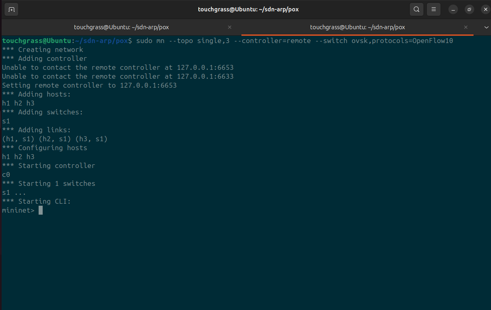
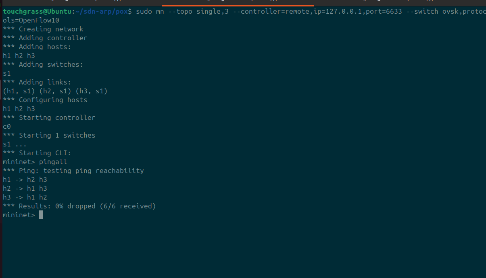
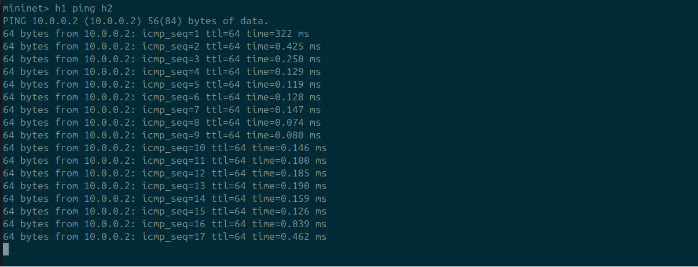
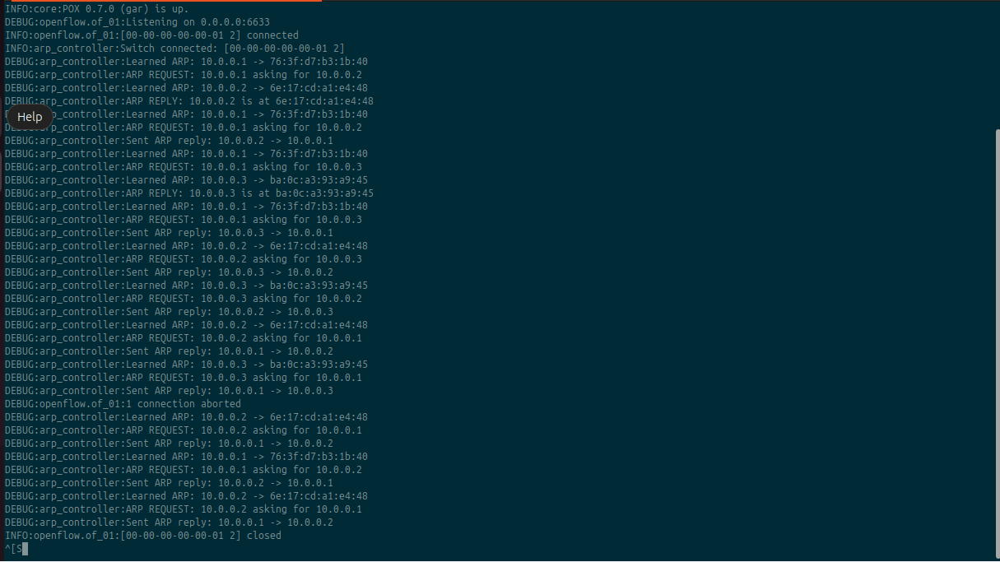

# SDN ARP Handling using POX Controller

A Software-Defined Networking project that implements ARP handling and L2 forwarding using the POX controller and Mininet emulation.

---

## Overview

This project intercepts ARP packets at an SDN controller to perform proxy ARP, discover host mappings, and install OpenFlow flow rules dynamically — reducing broadcast traffic and enabling efficient L2 forwarding.

---

## Architecture

| Component | Role |
|-----------|------|
| **Mininet** | Network emulation (hosts, switches, links) |
| **Open vSwitch** | Virtual OpenFlow switch |
| **POX Controller** | OpenFlow 1.0 controller — handles ARP, learns MACs, installs flow rules |

```
                    +---------------+
                    |  POX Controller|
                    | (arp_controller)|
                    +-------+-------+
                            |
                    OpenFlow (PacketIn/PacketOut)
                            |
                    +-------+-------+
                    |  Open vSwitch |
                    +---+-------+---+
                        |       |
                     [h1]     [h2]     [h3]
```

---

## Features

- **Proxy ARP** — Controller generates ARP replies on behalf of remote hosts
- **MAC Learning** — Controller tracks IP → MAC mappings from incoming packets
- **Dynamic Flow Rules** — Installs OpenFlow match-action rules to avoid re-processing every packet
- **Zero Broadcast** — Eliminates ARP flooding after initial discovery

---

## Setup

### 1. Install Dependencies

```bash
sudo apt update
sudo apt install -y mininet openvswitch-switch git python3
```

### 2. Clone and Setup POX

```bash
git clone https://github.com/noxrepo/pox.git
cd pox
mkdir -p ext
```

### 3. Add the Controller

```bash
cp /path/to/arp_controller.py pox/ext/
```

---

## Execution

### Terminal 1 — Start the Controller

```bash
cd pox
./pox.py log.level --DEBUG arp_controller
```

### Terminal 2 — Run Mininet

```bash
sudo mn --topo single,3 --controller=remote --switch ovsk,protocols=OpenFlow10
```

---

## Testing

### Test 1: View the Topology

```
mininet> net
```



### Test 2: Connectivity Test

```
mininet> pingall
```

All hosts should report **0% packet loss**.



### Test 3: ARP Handling

```
mininet> h1 ping h2
```

Watch the controller terminal for ARP handling logs:
- `Generating ARP reply` — Controller responds to ARP requests
- `Installing flow rule` — Rules get pushed to the switch



### Test 4: Inspect Flow Rules

In a separate terminal:

```bash
sudo ovs-ofctl dump-flows s1
```



---

## How It Works

1. **ARP Request arrives at switch** → Switch has no matching rule → PacketIn to controller
2. **Controller intercepts** → Learns IP → MAC mapping
3. **Controller generates ARP reply** → Sends PacketOut back to switch → Forwarded to requesting host
4. **Flow rule installed** → Subsequent packets bypass the controller and go directly through the switch

---

## Key Concepts Demonstrated

- SDN architecture (control plane vs. data plane separation)
- OpenFlow 1.0 PacketIn / PacketOut handling
- Match-action flow rule installation
- ARP proxying / ARP reply generation
- L2 learning switch behavior

---

## Conclusion

This project demonstrates effective SDN-based ARP handling using POX. By intercepting ARP at the controller, it reduces broadcast overhead and improves network efficiency through dynamic flow rule installation.
